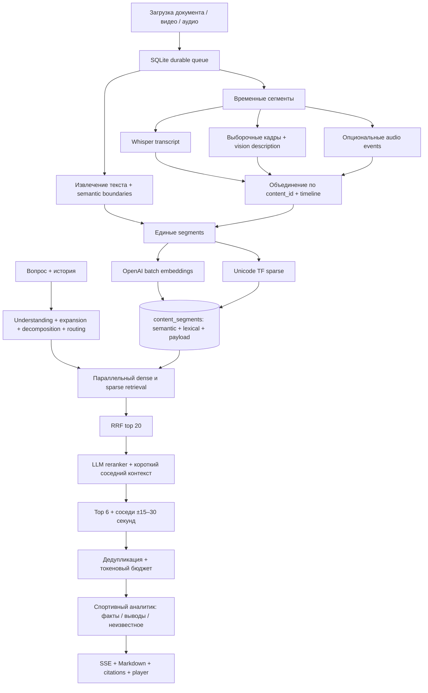

# Segment-first retrieval

`content_id` — запись источника, `segment_id` — UUIDv5 сегмента. Один segment представляет одну временную область файла или логическую часть документа. Отдельных коллекций для transcript/visual/audio нет. Семантические представления можно позднее разделить дополнительными named vectors, сохраняя IDs и payload.

`start_time/end_time` измеряются в секундах **от начала файла**. `half` и `match_clock_offset` — проверенная человеком привязка к матчу. Источники разных файлов могут относиться к одному `match_id`, но соседство не пересекает границы файла. Multi-hop связывание нескольких источников выполняется при формировании ответа через общий набор свидетельств, а не произвольным объединением timeline.

Частичные индексы не выдаются поиском (`state=ready` обязателен). Сбой до публикации оставляет staged points; повтор удаляет их и создает заново с теми же IDs. Сбой после публикации до обновления SQLite безопасен для повторного индексирования, но повторные модельные запросы не бесплатны.

Для эксплуатации: разделить API/worker, ввести lease-based очередь, stage checkpoints, object storage, идентичность пользователя и access filters на каждом запросе Qdrant. Текущий APP_TOKEN защищает целое общее пространство. Нельзя считать его tenant isolation.
